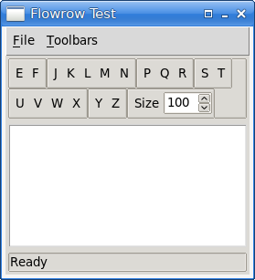
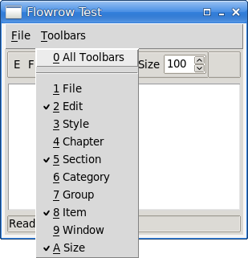
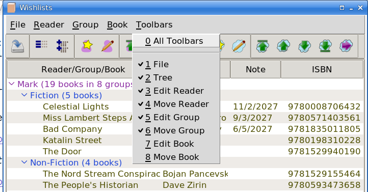

# Flowrow

A Tcl/Tk 9 module for creating and managing toolbars that automatically
adapts to the application’s width.

The `flowrow::Row` class is used to manage flowrow (`ttk::frame` widgets)
which themselves contain widgets (often ``ttk::button``s; but labels,
entries, and spinboxes all work too).

See `flowrow_test.tk` for an example of use. If the scale is too small,
pass a scale argument, e.g., `flowrow_test.tk 1.5`. It is also possible to
pass a theme argument, e.g., `flowrow_test.tk 1.5 classic` (the order of
arguments doesn’t matter). See also
[Wishlists](https://github.com/mark-summerfield/wishlist) a GUI book
wishlist manager which uses flowrow.

|  |
|:--:|
| *`flowrow_test.tk` showing some of its flowrow* |

|  |
|:--:|
| *`flowrow_test.tk` showing the Toolbar menu produced by flowrow* |

|  |
|:--:|
| *`wishlists.tk` showing the Toolbar & Toolbar menu produced by flowrow* |

Note: I use [Store](https://github.com/mark-summerfield/store) for version
control so github is only used to make the code public.

## Installing

The module is entirely self-contained. To use `flowrow-1.tm` either put it
in one of your package paths or copy it into your application’s folder.

## Documentation

See `flowrow.html`.

## Dependencies

Tcl/Tk >= 9.0.2.

## License

GPL-3. This module was created by a human.

---
